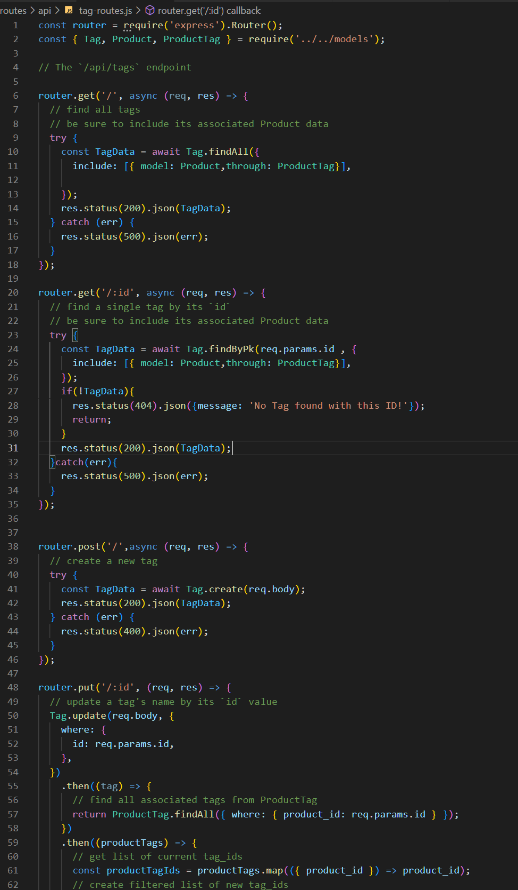

# ECommerceBackEnd

## Description 
Internet retail, also known as **e-commerce**, is the largest sector of the electronics industry, generating an estimated $29 trillion in 2019. E-commerce platforms like Shopify and WooCommerce provide a suite of services to businesses of all sizes. Due to their prevalence, understanding the fundamental architecture of these platforms will benefit you as a full-stack web developer. This app is build the back end for an e-commerce site. 

## demo
https://drive.google.com/file/d/1BjJbS-FsUR9OV4oNMErO8ov5wZ7Cra6J/view

https://drive.google.com/file/d/1708I2UD107IzIoHOOfTB5gR3QObcVRWC/view

## github link 
https://github.com/neiman924

https://github.com/neiman924/ECommerceBackEnd

## Table of Contents

- [Installation](#installation)
- [Usage](#usage)
- [Credits](#credits)
- [License](#license)
- [Tests](#tests)
- [Questions](#questions)

## installation
    npm i
    npm run watch

## usage
Internet retail, also known as **e-commerce**, is the largest sector of the electronics industry, generating an estimated $29 trillion in 2019. E-commerce platforms like Shopify and WooCommerce provide a suite of services to businesses of all sizes.
    ## screenshot
    
 
## credits
none

## license

# none
# none

## tests
none

## questions
- Please send me email if you had any questions, my email address is :
 neiman924@gmail.com

